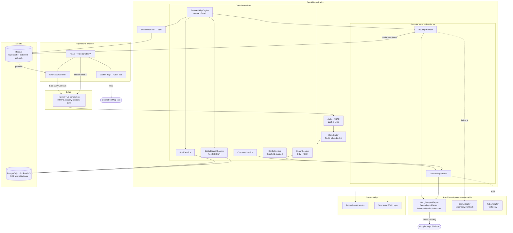
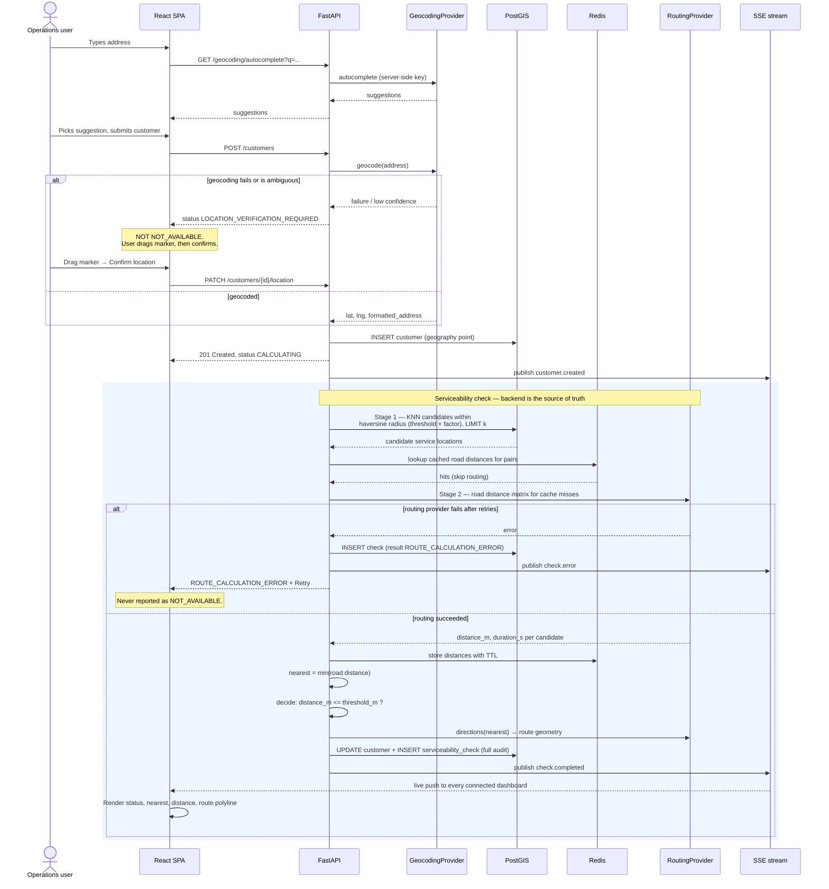
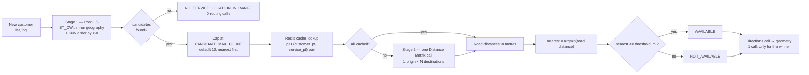
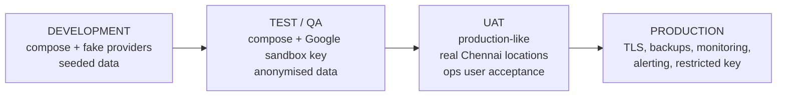

# System Architecture — Chennai Serviceability Platform

**Version:** 1.0
**Owner:** Vendolite Operations Engineering
**Core business rule:** `ACTUAL ROAD DISTANCE <= SERVICEABILITY_RADIUS_METERS (default 2000)` → `AVAILABLE`, otherwise `NOT_AVAILABLE`.

---

## 1. Stated assumptions

These are assumptions, not facts. Each one is called out because a wrong assumption here changes the build.

| # | Assumption | Impact if wrong |
|---|---|---|
| A1 | Routing + geocoding provider is **Google Maps Platform** (Geocoding API, Places Autocomplete, Distance Matrix API, Directions API), with a billing-enabled project and a server-side API key. | Swap the provider adapter only. Nothing else changes — see §5. |
| A2 | Existing service locations will be supplied later. Today they exist only as **points on a map image** (green/yellow markers plus a warehouse marker). Coordinates must be digitised before go-live. | Section §9 defines the digitisation path. The importer accepts CSV/XLSX and geocodes rows with missing coordinates. |
| A3 | Single warehouse in Chennai to start; the schema supports many. | None — `warehouses` is already a table, not a config value. |
| A4 | All coordinates are WGS84 (EPSG:4326). Distance maths is done in **integer metres**. | None. |
| A5 | Deployment is Docker Compose on a single Linux host for DEV/QA/UAT. Production may move to K8s later; the images are unchanged. | Add manifests; the application is stateless apart from Postgres and Redis. |
| A6 | Expected volume: hundreds of serviceability checks/day, growing to 10,000+ service locations. | Candidate capping and cache TTL are configurable, not hard-coded. |
| A7 | No existing CRM/ERP integration in phase 1. Customers are created in this application. | An inbound adapter is added behind `ImportService`; the domain model does not change. |
| A8 | Users are internal Vendolite staff authenticated with username + password. No SSO in phase 1. | Add an OIDC provider behind the same `User` model and role mapping. |

---

## 2. Technology choices and why

| Layer | Choice | Reason |
|---|---|---|
| Database | **PostgreSQL 16 + PostGIS 3.4** | Stage-1 candidate search needs a real spatial index. PostGIS `<->` KNN operator over a GiST index returns the *k* nearest locations in sub-millisecond time at 10,000+ rows. No other choice in the stack does this without an extra service. |
| Backend | **Python 3.11 + FastAPI** | Async-native, which matters because a serviceability check fans out to an external HTTP API and must not block a worker. Pydantic gives request validation for free (mandatory per §20 of the brief). GeoAlchemy2 maps PostGIS types directly to the ORM. |
| ORM / migrations | SQLAlchemy 2.0 + GeoAlchemy2 + Alembic | Versioned, reversible migrations are a rollback requirement. |
| Cache / rate limit | **Redis 7** | Route-result cache (§19 cost control), token-bucket rate limiter, and SSE fan-out across multiple API workers. |
| Frontend | **React 18 + TypeScript + Vite** | Type safety against the generated API schema; fast dev loop. |
| Map | **Leaflet + OpenStreetMap tiles** | Deliberate: it means **no Google key is ever shipped to the browser**. Every Google call (geocode, autocomplete, distance matrix, directions) is proxied by the backend. Route geometry comes back as a decoded polyline and is drawn as a Leaflet layer. This directly satisfies "Do not expose routing API keys in frontend code". |
| Real-time | **Server-Sent Events over Redis pub/sub** | The dashboard is read-mostly and one-directional. SSE is simpler than WebSocket, survives proxies, and auto-reconnects. Multiple operations users each hold one SSE stream; events fan out through Redis so any API replica can publish. |
| Tests | pytest + pytest-asyncio + httpx | The 10 acceptance scenarios in §25 of the brief run against a fake routing provider so they are deterministic and cost nothing. |
| Metrics | prometheus-client | Scrape endpoint at `/metrics`; alert rules shipped in `deploy/prometheus/`. |

**Why not straight-line distance as the decision.** Haversine is used *only* to build the Stage-1 candidate set, and it is deliberately over-inclusive (default 4× the threshold). The value stored in `serviceability_checks.calculated_distance_meters` and compared against the threshold is always a road distance returned by the routing provider, tagged `distance_type = 'ROAD_DISTANCE'`. There is no code path that can decide `AVAILABLE`/`NOT_AVAILABLE` from a geodesic distance — see the guard in `ServiceabilityEngine._decide()`.

---

## 3. Component diagram



**The key security property visible in this diagram:** the browser talks only to Nginx. There is no arrow from `Browser` to `Google Maps Platform`. Map tiles come from OSM, which needs no key.

---

## 4. Serviceability sequence



---

## 5. Provider abstraction

Nothing in the domain layer imports the Google SDK. Two ports are defined in `app/providers/base.py`:

```python
class RoutingProvider(Protocol):
    name: str
    async def get_driving_distance(origin, destinations) -> list[RouteLeg | None]
    async def get_driving_route(origin, destination) -> RouteDetail   # with geometry
    async def health_check() -> bool

class GeocodingProvider(Protocol):
    name: str
    async def geocode(address, *, region_bias) -> GeocodeResult
    async def reverse_geocode(lat, lng) -> GeocodeResult
    async def autocomplete(query, *, session_token) -> list[AddressSuggestion]
```

Adapters implemented: `GoogleMapsAdapter` (primary), `OsrmAdapter` (secondary/fallback and self-host option), `FakeRoutingProvider` / `FakeGeocodingProvider` (tests). Selection is by environment variable `ROUTING_PROVIDER` / `GEOCODING_PROVIDER`, resolved through a registry in `app/providers/registry.py`. Changing provider is a config change and a restart — no code edit.

Every adapter is wrapped by `ResilientRoutingProvider`, which supplies timeout, bounded retry with exponential backoff and jitter, rate-limit (HTTP 429) handling, circuit breaking, Prometheus timing, and cache read/write. Adapters therefore stay thin and easy to add.

---

## 6. Two-stage performance design



Cost per check in the worst case: **1 geocode + 1 Distance Matrix element-batch + 1 Directions call**, regardless of whether there are 100 or 100,000 service locations. With a warm cache it is often **zero** routing calls.

Stage 1 radius is `threshold_m × CANDIDATE_RADIUS_FACTOR` (default 4.0 → 8 km for a 2 km threshold). The factor exists because road distance always exceeds straight-line distance; a detour ratio of 4 is generous for Chennai's grid and guarantees the true road-nearest location is inside the candidate set. It is configurable and audited.

---

## 7. Data flow of the audit record

Every check writes one immutable row to `serviceability_checks` containing: customer, customer coordinates at time of check, nearest service location, road distance in metres, `distance_type = 'ROAD_DISTANCE'`, routing provider name, route duration, **the threshold that was in force at that moment**, the result, request and response timestamps, the initiating user, the candidate count, and whether the result came from cache. Rows are never updated or deleted — the rollback runbook depends on this.

---

## 8. Environments



Each environment has its own `.env` file, its own database, and its own Google API key with its own quota and IP restriction. No environment shares credentials. Nothing is developed against production.

---

## 9. Digitising the existing map image (assumption A2)

The existing service locations currently exist only as coloured markers on an operational map image. Until real coordinates are supplied, the system runs on generated Chennai seed data so it is demonstrable end to end. Three supported paths to real data, in order of accuracy:

1. **Export from the source system** that produced the map (Google My Maps → KML/CSV, or the CRM behind it). Highest fidelity — real coordinates, no re-derivation. Feed straight into the importer.
2. **Address list → geocode.** Supply a CSV of customer IDs, names and addresses with no coordinates. The importer geocodes each row via Google, flags low-confidence results, and produces a validation report for manual review before activation. This is the expected path.
3. **Manual pin placement.** For any location whose address does not geocode cleanly, an operations user places it on the map in the admin screen and confirms. Every manual placement is audited.

The colour coding on the image (green / yellow) maps to `service_locations.status` — the importer accepts a `status` column and the admin UI renders each status with a distinct marker **and a text label**, never colour alone.

---

## 10. Module boundaries

Per §33 of the brief, these are separate modules with no circular dependencies:

```
app/
  api/            HTTP layer only — no business logic
  core/           config, security, logging, metrics, errors
  db/             session, base, spatial helpers
  models/         SQLAlchemy models
  schemas/        Pydantic request/response contracts
  providers/      geocoding + routing ports and adapters
  services/       customer, spatial_search, serviceability engine,
                  config, import, audit, events, reporting
  workers/        background tasks
```

Dependency direction is strictly `api → services → (providers, models)`. The frontend contains **no serviceability logic**; it renders the backend's decision and nothing else.
