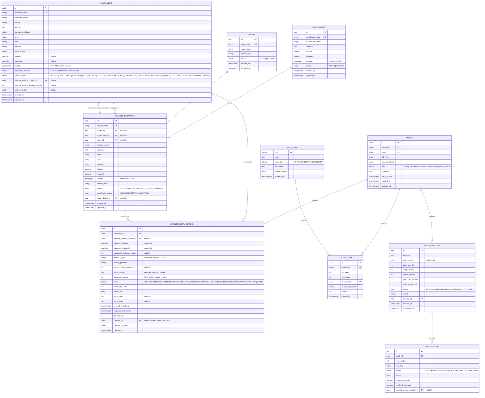

# Database Design — ER Diagram and Schema

**Engine:** PostgreSQL 16 with PostGIS 3.4. All geometry columns are `geography(Point, 4326)` so that PostGIS distance functions return **metres** directly, with no projection step and no unit ambiguity.

---

## 1. ER diagram



---

## 2. Why these tables look like this

**`location` is `geography` not `geometry`.** `ST_Distance` on `geography` returns metres on the spheroid. With `geometry(4326)` it would return degrees and every call site would need a projection, which is exactly the kind of unit confusion that produces a wrong serviceability decision.

**Both `latitude`/`longitude` and `location` are stored.** The numeric columns are the human-readable source of truth used in reports, exports and the API contract; `location` is derived and maintained by a database trigger so it can never drift from the numerics. This means an operator editing latitude via SQL cannot leave a stale spatial index entry.

**`serviceability_checks.threshold_meters` is `NOT NULL`.** The brief is explicit: never store a result without the threshold used. If the threshold is changed from 2000 to 2500 next quarter, historic decisions remain explainable.

**`calculated_distance_meters` is `INTEGER`.** §17 of the brief requires that exactly 2000 m is AVAILABLE and 2000.01 m is NOT. Storing and comparing integers removes float equality risk entirely. Provider responses are rounded to the nearest metre on ingest, once, at the adapter boundary.

**`serviceability_checks` has no `updated_at`.** It is append-only by design. There is no API path and no service method that updates or deletes a row in this table.

**`customers.service_status` includes non-terminal states.** `CALCULATING`, `LOCATION_VERIFICATION_REQUIRED` and `ROUTE_CALCULATION_ERROR` are first-class statuses so that a geocoding or routing failure can never be silently collapsed into `NOT_AVAILABLE`.

**`coordinate_source`** records whether a point came from geocoding, an import file, or an operator dragging the marker. Needed for the data-quality review in the go-live checklist.

---

## 3. Indexes

| Index | Table | Type | Purpose |
|---|---|---|---|
| `ix_service_locations_location_gist` | service_locations | GiST on `location` | Stage-1 KNN candidate search. The single most performance-critical index in the system. |
| `ix_service_locations_active_location` | service_locations | GiST, partial `WHERE status='ACTIVE'` | Candidate search only ever considers active locations; the partial index keeps it small as inactive rows accumulate. |
| `ix_customers_location_gist` | customers | GiST on `location` | Map viewport queries, density reporting. |
| `ix_warehouses_location_gist` | warehouses | GiST on `location` | Map queries. |
| `ix_service_locations_service_code` | service_locations | unique btree | Import duplicate detection. |
| `ix_customers_customer_code` | customers | unique btree | Import duplicate detection. |
| `ix_checks_customer_created` | serviceability_checks | btree `(customer_id, created_at DESC)` | "latest check for this customer" — the hot read path. |
| `ix_checks_created_at` | serviceability_checks | btree `created_at DESC` | History listing and daily dashboard metrics. |
| `ix_checks_result_created` | serviceability_checks | btree `(result, created_at DESC)` | Dashboard AVAILABLE / NOT_AVAILABLE counters. |
| `ix_service_locations_route` | service_locations | btree `route_id` | Route-level reporting. |

---

## 4. Stage-1 candidate query

This is the query that keeps the system fast at 10,000+ locations. It uses `ST_DWithin` (index-assisted, bounded) together with the `<->` KNN ordering operator, which PostGIS evaluates using the GiST index rather than by sorting all rows.

```sql
SELECT
    sl.id,
    sl.service_code,
    sl.location_name,
    sl.latitude,
    sl.longitude,
    ST_Distance(sl.location, :origin)::int AS straight_line_meters
FROM service_locations sl
WHERE sl.status = 'ACTIVE'
  AND ST_DWithin(sl.location, :origin, :candidate_radius_meters)
ORDER BY sl.location <-> :origin
LIMIT :max_candidates;
```

`straight_line_meters` is returned **for diagnostics and ordering only**. It is never compared against the threshold. The service layer discards it before the decision step.

---

## 5. Trigger that keeps `location` consistent

```sql
CREATE OR REPLACE FUNCTION sync_location_from_latlng() RETURNS trigger AS $$
BEGIN
    IF NEW.latitude IS NULL OR NEW.longitude IS NULL THEN
        NEW.location := NULL;
    ELSE
        NEW.location := ST_SetSRID(ST_MakePoint(NEW.longitude, NEW.latitude), 4326)::geography;
    END IF;
    RETURN NEW;
END;
$$ LANGUAGE plpgsql;
```

Applied `BEFORE INSERT OR UPDATE` on `customers`, `service_locations` and `warehouses`.

Note the argument order: `ST_MakePoint(longitude, latitude)`. Reversing it is the most common PostGIS bug and would silently place every Chennai location in the Indian Ocean. It is asserted in `tests/test_spatial.py`.

---

## 6. Coordinate validity constraints

```sql
ALTER TABLE service_locations
    ADD CONSTRAINT ck_service_locations_lat CHECK (latitude  BETWEEN -90  AND 90),
    ADD CONSTRAINT ck_service_locations_lng CHECK (longitude BETWEEN -180 AND 180),
    ADD CONSTRAINT ck_service_locations_latlng_pair
        CHECK ((latitude IS NULL) = (longitude IS NULL));
```

The paired constraint prevents a half-set coordinate, which would otherwise produce a NULL `location` that silently drops the row out of every candidate search.

An optional bounding-box guard for the Chennai pilot is available as a configurable soft validation in the importer (`IMPORT_BBOX_*`), reported as a warning rather than enforced in the database, because expansion beyond Chennai is a stated future requirement.
